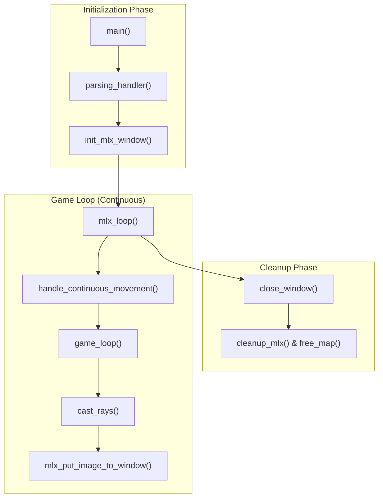
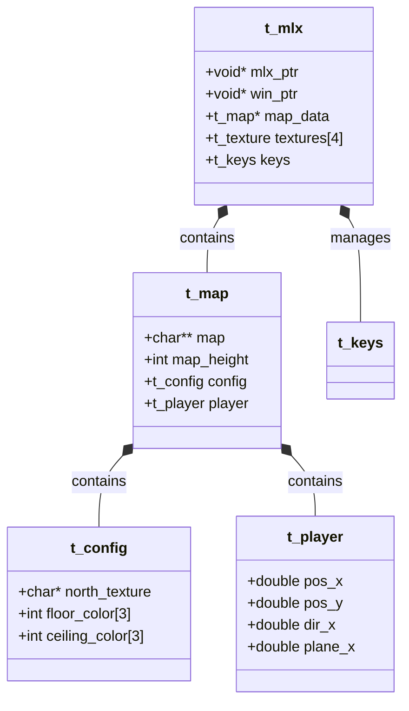

# cub3D Overview
cub3D is a first-person graphical engine built in C, inspired by the classic Wolfenstein 3D. It utilizes the **Raycasting** technique to render a 2D map into a 3D perspective in real-time. The project is built using the MiniLibX library and follows strict validation rules for map configuration and player movement.

### Core Engine Workflow

The application follows a linear lifecycle: it validates command-line arguments, parses a `.cub` scene description file, initializes the graphical window, and enters a continuous render loop that handles user input and raycasting.

#### High-Level Execution Flow

Title: System Execution Flow

Sources: [src/main.c15-35](https://github.com/Igbescobar/cub3d/blob/f988884d/src/main.c#L15-L35)[includes/cub3d.h222-231](https://github.com/Igbescobar/cub3d/blob/f988884d/includes/cub3d.h#L222-L231)

---

### Getting Started: Build & Run

To run cub3D, you must compile the source using the provided `Makefile`. The engine requires a `.cub` file as its sole argument, which contains the texture paths, floor/ceiling colors, and the map layout.

- **Compilation**: Use `make` to generate the `cub3D` executable.
- **Execution**: `./cub3D maps/good/subject.cub`

For a detailed guide on dependencies (like MiniLibX and libft), OS-specific requirements, and Makefile targets, see **[Getting Started: Build & Run](/Igbescobar/cub3d/1.1-getting-started:-build-and-run)**.

Sources: [src/main.c15-24](https://github.com/Igbescobar/cub3d/blob/f988884d/src/main.c#L15-L24)[includes/cub3d.h168-171](https://github.com/Igbescobar/cub3d/blob/f988884d/includes/cub3d.h#L168-L171)

---

### Major Subsystems

The codebase is organized into distinct modules that handle specific aspects of the engine.

#### 1. Parsing & Validation

Before rendering begins, the engine must verify the integrity of the `.cub` file. This involves reading texture paths, RGB colors, and ensuring the map is fully enclosed by walls (`1`).

- **Key Entities**: `parsing_handler`, `parse_config_from_file`, `validate_enclosure`.
- For details, see **[Map Format & Parsing Pipeline](/Igbescobar/cub3d/2-map-format-and-parsing-pipeline)**.

#### 2. Raycasting Engine

The heart of the project. It calculates the distance to walls for every vertical strip of the screen using the **DDA (Digital Differential Analyzer)** algorithm.

- **Key Entities**: `t_ray`, `cast_rays`, `perform_dda`, `calculate_textured_wall`.
- For details, see **[Raycasting Engine](/Igbescobar/cub3d/3-raycasting-engine)**.

#### 3. Player & Input System

Handles the player's state (position, direction, camera plane) and processes keyboard events for smooth, non-blocking movement.

- **Key Entities**: `t_player`, `t_keys`, `handle_continuous_movement`, `rotate_player`.
- For details, see **[Player System](/Igbescobar/cub3d/4-player-system)**.

#### 4. Graphics & Window Management

Manages the MiniLibX hooks, image buffers (double-buffering), and the 2D minimap overlay.

- **Key Entities**: `t_mlx`, `game_loop`, `init_mlx_display`, `render_2d_map`.
- For details, see **[Window Management & Rendering Loop](/Igbescobar/cub3d/5-window-management-and-rendering-loop)**.

---

### Data Architecture

The project relies on a hierarchy of structures to pass data between the parsing and rendering stages. The `t_mlx` struct acts as the primary "God Object" during execution, containing pointers to the map, textures, and player state.

Title: Core Data Associations

Sources: [includes/cub3d.h50-58](https://github.com/Igbescobar/cub3d/blob/f988884d/includes/cub3d.h#L50-L58)[includes/cub3d.h77-85](https://github.com/Igbescobar/cub3d/blob/f988884d/includes/cub3d.h#L77-L85)[includes/cub3d.h102-109](https://github.com/Igbescobar/cub3d/blob/f988884d/includes/cub3d.h#L102-L109)[includes/cub3d.h145-158](https://github.com/Igbescobar/cub3d/blob/f988884d/includes/cub3d.h#L145-L158)
